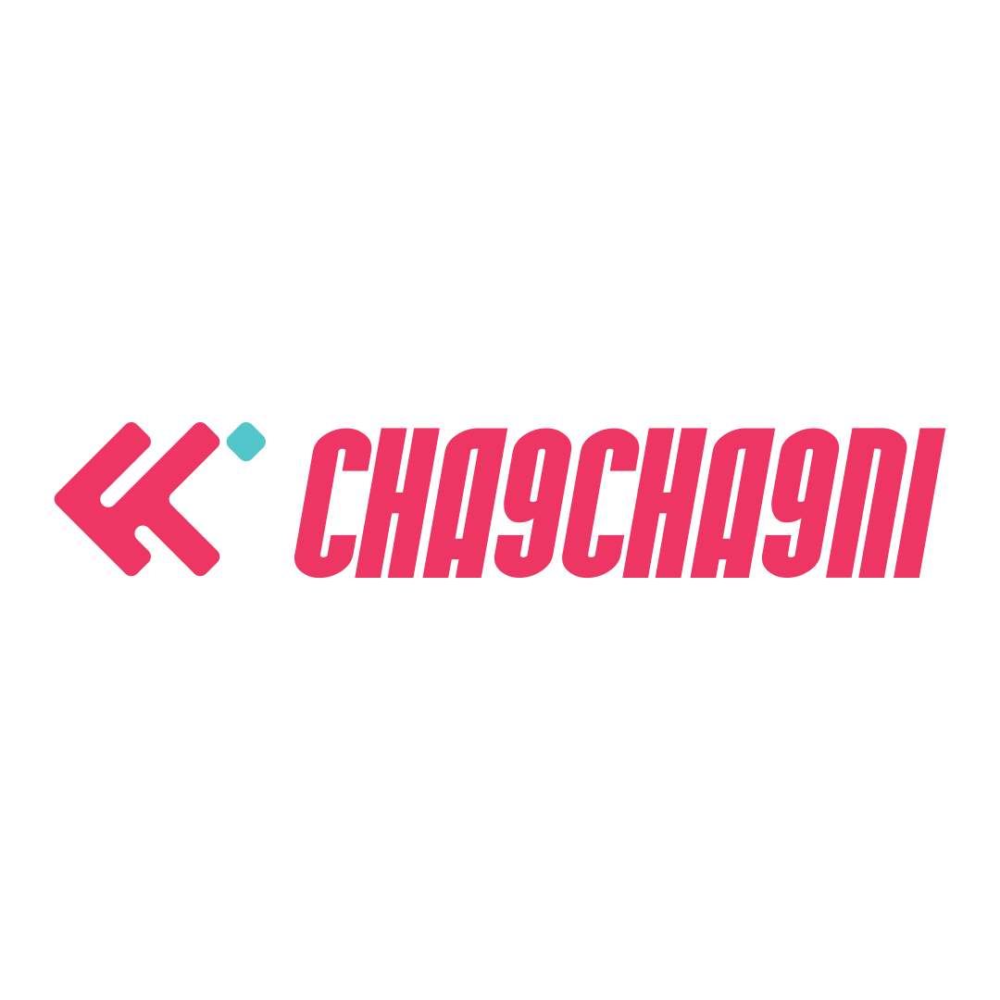

# 🎯 Cha9cha9ni - Smart Family Savings Platform

<div align="center">
  
  
  **Empowering Tunisian Families to Save Together**
  
  [](https://flutter.dev)
  [](https://dart.dev)
  [](LICENSE)
</div>

---

## 📖 About Cha9cha9ni

**Cha9cha9ni** is a revolutionary family-oriented savings mobile application designed specifically for Tunisian families. It transforms traditional saving habits into a collaborative, controlled, and rewarding experience where families work together towards their financial goals.

### 🌟 The Vision

In Tunisia, families often struggle with collective financial planning and controlled savings. Cha9cha9ni solves this by creating a secure, structured environment where families can save together, earn rewards, and access funds only when it truly matters.

---

## ✨ Key Features

### 👨‍👩‍👧‍👦 Family-Centric Design
- **Multi-Member Support**: Each family account supports up to **5 members**
- **Dual Leadership Model**: Family creator can delegate withdrawal authority to **1 trusted member**
- **Role-Based Permissions**: Structured hierarchy ensures financial security

### 💰 Smart Withdrawal System
- **Event-Based Withdrawals**: Access funds during major Tunisian holidays
  - 🕌 **Eid al-Fitr** (Eid Saghir)
  - 🐑 **Eid al-Adha** (Eid Kbir) - 1,000 TND withdrawal limit per family
  - And other significant dates
- **Custom Date Selection**: Choose your own withdrawal dates based on subscription tier
- **Flexible Limits**: Basic users can withdraw specified amounts; premium users enjoy enhanced flexibility

### 🎁 Subscription Tiers

| Tier | Custom Withdrawal Dates | Benefits |
|------|------------------------|----------|
| **Basic** | 1 custom date | Standard withdrawal limits |
| **Silver** | 2 custom dates | Increased flexibility |
| **Gold** | 3 custom dates | Enhanced access |
| **Platinum** | 5 custom dates | Maximum control |

### 🎬 Rewards Program
- **Watch & Earn**: Family members earn points by watching advertisement videos
- **Daily Opportunities**: Each member can watch **5 videos per day**
- **Family Accumulation**: Up to **25 videos daily** per family (5 members × 5 videos)
- **Point Redemption**: Convert earned points directly into savings

### 💳 Flexible Deposit Options

#### Credit Card Deposits
- **Transaction Fee**: 5%
- **Example**: Deposit 1 TND → Charged 1.05 TND
- Instant processing and secure transactions

#### Redeemable Cards
Perfect for families with young children or those who prefer physical cards.

**Direct Purchase (Our Store)**
- **Fee**: 8%
- **Example**: 1 TND card costs 1.08 TND
- Available at Cha9cha9ni retail locations

**Retail Partner Purchase (Drug Stores)**
- **Customer Price**: 1.15 TND for 1 TND value
- **Partner Benefit**: We supply at 1.08 TND, partners earn margin
- Convenient locations across Tunisia

---

## 🎨 Platform Strategy

### 📱 Mobile Application (Primary Focus)
Full-featured Flutter application providing:
- Complete family savings management
- Video rewards system
- Real-time balance tracking
- Multi-language support (Arabic, French, English)
- Secure authentication and authorization
- Push notifications for important events

### 🌐 Web Platform (Informational)
Professional landing page featuring:
- Company mission and values
- Feature showcases
- Download links (App Store & Google Play)
- Contact information
- FAQs and support resources

---

## 🏗️ Technical Architecture

### Frontend Stack
- **Framework**: Flutter 3.0+
- **Language**: Dart 3.0+
- **State Management**: [Your choice - Provider/Riverpod/Bloc]
- **Internationalization**: flutter_localizations (AR, FR, EN)
- **UI/UX**: Material Design 3 with custom theming

### Project Structure
```
lib/
├── main.dart                 # Application entry point
├── core/                     # Core functionality
│   ├── services/            # API, Auth, Storage services
│   ├── theme/               # App colors, text styles
│   └── widgets/             # Reusable components
├── features/                # Feature modules
│   ├── auth/               # Authentication
│   ├── onboarding/         # User onboarding
│   ├── family/             # Family management
│   ├── savings/            # Deposit & withdrawal
│   ├── rewards/            # Video ads & points
│   └── subscription/       # Premium tiers
└── l10n/                    # Localization files
```

### Key Features in Development
- ✅ Onboarding flow
- ✅ Authentication system
- ✅ Theme & styling foundation
- ✅ Multi-language support
- 🚧 Family account creation
- 🚧 Savings management
- 🚧 Rewards system
- 🚧 Payment integration

---

## 🚀 Getting Started

### Prerequisites
- Flutter SDK (3.0 or higher)
- Dart SDK (3.0 or higher)
- iOS development: Xcode 14+
- Android development: Android Studio with SDK 21+

### Installation

1. **Clone the repository**
   ```bash
   git clone https://github.com/yourusername/cha9cha9ni_front.git
   cd cha9cha9ni_front
   ```

2. **Install dependencies**
   ```bash
   flutter pub get
   ```

3. **Generate localizations**
   ```bash
   flutter gen-l10n
   ```

4. **Run the application**
   ```bash
   # For development
   flutter run
   
   # For specific platform
   flutter run -d ios
   flutter run -d android
   ```

### Build for Production

```bash
# Android
flutter build apk --release
flutter build appbundle --release

# iOS
flutter build ios --release
```

---

## 🌍 Localization

Cha9cha9ni supports three languages:
- 🇹🇳 **Arabic** (ar) - Primary language
- 🇫🇷 **French** (fr)
- 🇬🇧 **English** (en)

Localization files are located in `lib/l10n/`:
- `app_ar.arb` - Arabic translations
- `app_fr.arb` - French translations
- `app_en.arb` - English translations

---

## 🎯 Roadmap

### Phase 1: Foundation (Current)
- [x] Project setup & architecture
- [x] Onboarding & authentication UI
- [x] Theme & localization
- [ ] Backend API integration
- [ ] Family account creation

### Phase 2: Core Features
- [ ] Savings deposit system
- [ ] Withdrawal request flow
- [ ] Event-based withdrawal rules
- [ ] Credit card payment integration
- [ ] Redeemable card system

### Phase 3: Rewards & Engagement
- [ ] Video advertisement integration
- [ ] Points tracking system
- [ ] Daily video limits enforcement
- [ ] Points-to-money conversion

### Phase 4: Premium & Scale
- [ ] Subscription tier implementation
- [ ] Enhanced analytics dashboard
- [ ] Push notification system
- [ ] Customer support chat

### Phase 5: Distribution
- [ ] App Store submission
- [ ] Google Play release
- [ ] Marketing website launch
- [ ] Retail partner network

---

## 🤝 Contributing

We welcome contributions to Cha9cha9ni! Please follow these steps:

1. Fork the repository
2. Create a feature branch (`git checkout -b feature/AmazingFeature`)
3. Commit your changes (`git commit -m 'Add some AmazingFeature'`)
4. Push to the branch (`git push origin feature/AmazingFeature`)
5. Open a Pull Request

---

## 📄 License

This project is licensed under the MIT License - see the [LICENSE](LICENSE) file for details.

---

## 📞 Contact & Support

- **Website**: [www.cha9cha9ni.tn](https://www.cha9cha9ni.tn) *(coming soon)*
- **Email**: support@cha9cha9ni.tn
- **Facebook**: [@cha9cha9ni](https://facebook.com/cha9cha9ni)
- **Instagram**: [@cha9cha9ni_app](https://instagram.com/cha9cha9ni_app)

---

## 🙏 Acknowledgments

- Built with ❤️ for Tunisian families
- Powered by Flutter & Dart
- Designed to promote financial literacy and family unity

---

<div align="center">
  <strong>Cha9cha9ni - Together We Save, Together We Prosper</strong>
  
  Made with 🇹🇳 in Tunisia
</div>
